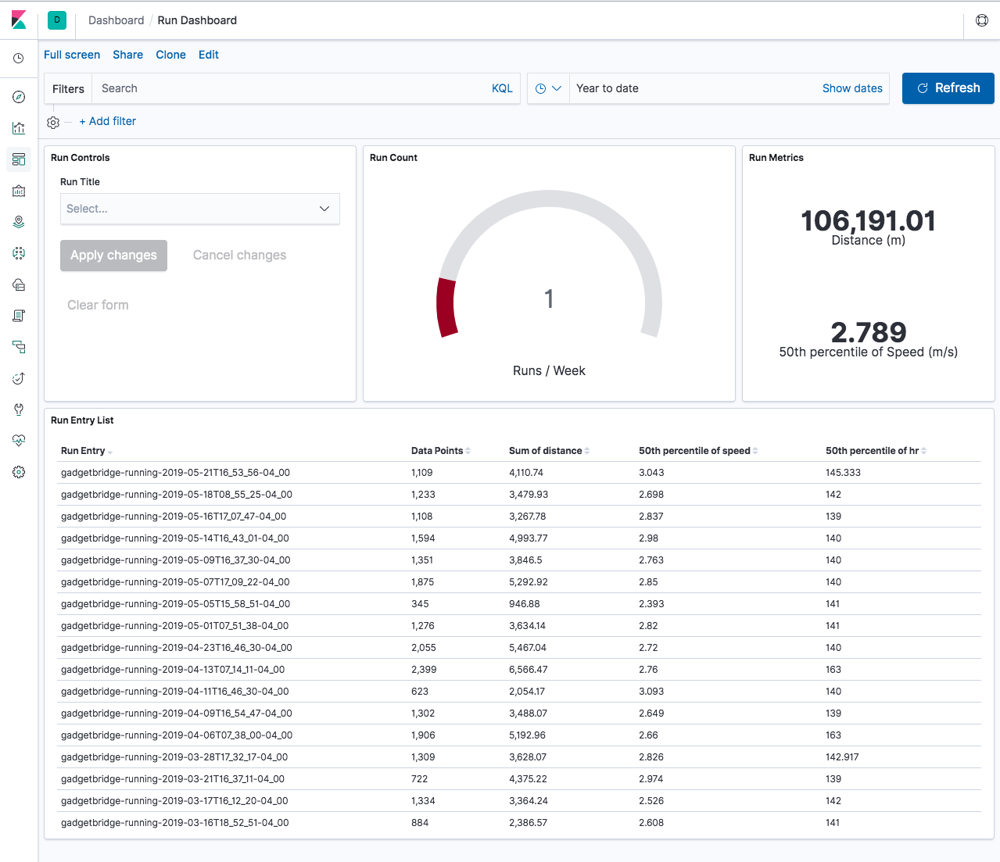
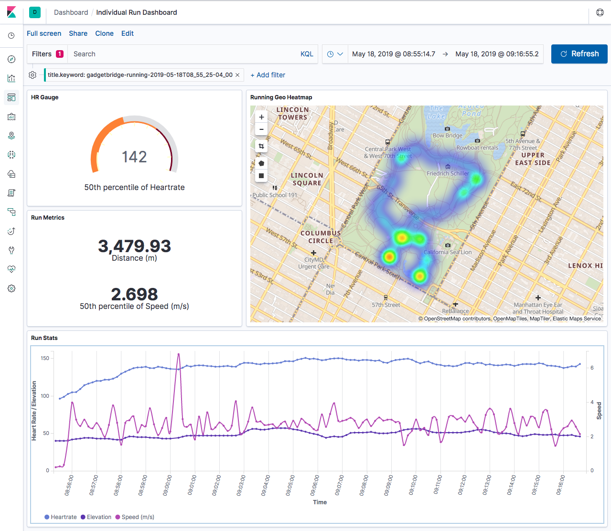

# Kibana Running Analysis Configuration

This repository holds the configurations for a kibana environment to allow importing visualizations and dashboards related to running.


> Dashboard with a list and overall stats of runs over a given time period.


> Individual run analysis dashboard

## Setup

These configurations are used in tandem with the [Datamnom](https://github.com/cjsaylor/datamnom) import tool. It assumes an Elasticsearch index called `running` that has the following mapping:

```json
{
    "properties": {
        "location": { "type" : "geo_point" },
        "timestamp": { "type" : "date" },
        "elevation": { "type" : "integer" },
        "distance": { "type" : "double" },
        "speed": { "type" : "double" },
        "hr": { "type" : "integer" }
    }
}
```
> See [gpx.json](https://github.com/cjsaylor/datamnom/blob/d8edddd18bccc6c2875d0a59c83e7d46303cf5d0/examples/gpx.json) for an example of having this mapping imported with the Datamnom tool.

For example, the Datamnom CLI command I use to import:

```
node index.js --files=/Users/christophersaylor/Google\ Drive/Amazfit/gadgetbridge-running-*.gpx --config=./examples/gpx.json
```

Once your index is created, you can use Kibana's [saved objects import](http://localhost:5601/app/kibana#/management/kibana/objects) to import the any `*_export.json` file in this repository.